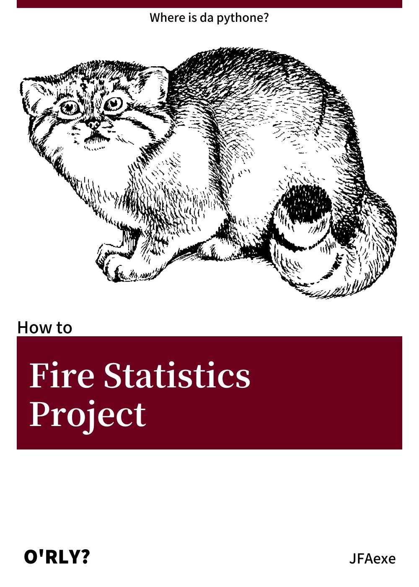

# Проект для вузовской практики

Разработан на языке `Go`, с использованием библиотек [gota](https://github.com/go-gota/gota), [orederedmap](https://github.com/elliotchance/orderedmap) и [go-echarts](https://github.com/go-echarts/go-echarts)

- Обработка данных в формате `.csv`
- Отображение статистики в виде `html` страницы при помощи http сервера
- Столбчатые и круговые диаграммы, карты




## Использование

Сборка проекта

```
go build -ldflags "-s -w"
```

Запуск (windows)

```
.\FireStatisticsProject.exe .data\sample_202.csv .\data\thermopoints.csv
```

Запуск c флагами (windows)

```
.\FireStatisticsProject.exe -oldmap -radius=3 -port=":2022" .\data\thermopoints.csv
```

### Флаги

`-oldmap` - использовать устаревшую версию карты, без подробного разделения на регионы

`-radius` - радиус в которому будут суммироваться точки для уменьшения количества отрисовок

`-port` - порт для `http` сервера


## Источники

- [Данные для устаревшей карты](https://github.com/echarts-maps/echarts-countries-js)
- [Данные для подробной карты](https://github.com/timurkanaz/Russia_geojson_OSM)
- [Программа обработки `geojson`](https://github.com/echarts-maps/echarts-mapmaker)
- [Инструкция по работе с картами echarts](https://echarts-maps.github.io/echarts-geomapping-book-en/)
- [`JS` рантайми диаграмм](https://github.com/go-echarts/go-echarts-assets)


## Примечание к датасету

```
Пожары в России: данные о местах и типах природных пожаров за 2012–2021гг.
// МЧС; обработка: Новиков В.А., Тихонов С.В.,
Инфраструктура научно-исследовательских данных. АНО «ЦПУР», 2022.
Доступ: Лицензия CC BY-SA. Размещено: 31.03.2022.
(Ссылка на набор данных: http://data-in.ru/data-catalog/datasets/202/)
```


## Лицензии

Проект распространяется под лицензией [MIT](LICENSE)

Данные использованы под лицензией [CC BY-SA](https://wiki.data-in.ru/index.php/Лицензия_обезличенных_датасетов_с_возможностью_скачивания)

`JS` рантайми диаграмм использован под лицензией [APACHE 2.0](https://www.apache.org/licenses/LICENSE-2.0)

Шрифт `Exo 2` использован под лицензией [OFL](https://scripts.sil.org/cms/scripts/page.php?site_id=nrsi&id=OFL)